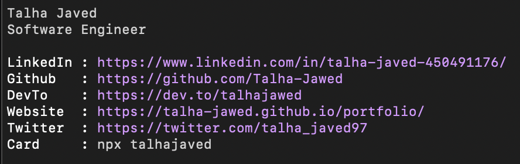

# [talhajaved](https://www.npmjs.com/package/talhajaved)

<center></center>

Having your own npm package is fun.

Created a [business card](https://www.npmjs.com/package/najamshehzad) inspired by [najam shehzad](https://www.linkedin.com/in/najamshehzadbutt/)'.


Run below from your terminal.
```bash
npx talhajaved
```